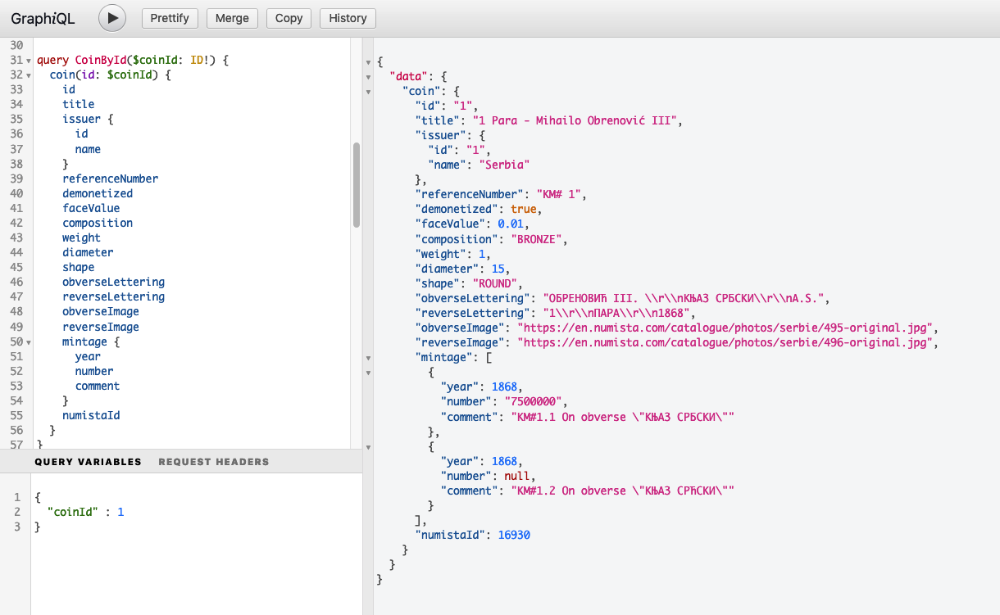
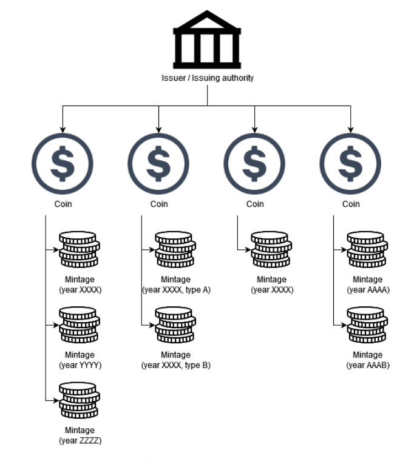
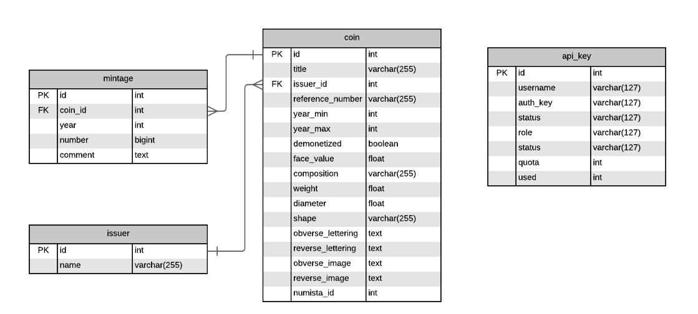

## numista-graphql
A demo project for GraphQL with Spring Boot

GraphQL topics covered in this implementation:
- [x] Query
- [x] Mutation
- [ ] Subscription
- [x] Directive
- [x] Scalar
- [x] Enum

### Getting started

Run `build_and_run.sh` to build a docker image and run it on port 8089

Alternatively, build a project with `mvn clean install` and then execute `java -jar ./target/numista-graphql.jar`. You will need Java 11.

### Project structure

#### Source files
| Package    | Description                                                                                                                   |
|------------|-------------------------------------------------------------------------------------------------------------------------------|
| entity     | Database entities                                                                                                             |
| exception  | Contains exceptions used in GraphQL queries and mutations                                                                     |
| model      | Request and response objects                                                                                                  |
| repository | Database persistence interfaces                                                                                               |
| resolver   | Contains resolver classes for queries, mutations, directives and scalars                                                      |
| rest       | Contains a rest implementation of one service (to use as a comparison; this package is not needed for GraphQL implementation) |
| security   | Most simple security implementation with stateful API tokens                                                                  |
| service    | Business logic                                                                                                                |

#### Resources
| file/folder          | Description                                                                                                                                      |
|----------------------|--------------------------------------------------------------------------------------------------------------------------------------------------|
| application.yml      | Spring configuration for local/dev environment                                                                                                   |
| application-prod.yml | Spring configuration for staging/production environment. You will need to set profile `prod` to active. The GraphiQL and H2 console are disabled |
| schema.sql           | Database schema used for an application                                                                                                          |
| data.sql             | Sample data for this application                                                                                                                 |
| graphql/             | A directory containing all GraphQL schema definitions (models, queries, mutations, directives, enums, scalars)                                   |
| playground/          | A directory to automatically populate GraphiQL with example queries and request parameters                                                       |

### Relations and database

Relations are defined as this: One `issuing authority` is issuing (or minting) various `coins`. Each coin can be `minted` in different year and can be of different type.

The application uses `H2 in-memory database` because it is easy to setup. This can easily be substituted by some other RDBMS.

### Security

Security is implemented in a most basic way. The focus of this application was not security, but this security implementation can be used as a demo of what can be achieved with GraphQL.

#### Authentication

In order for user to make GraphQL calls, a header `x-api-key` needs to be present with a valid API key. The keys are created by admin and are stored in a table `api_key`.

Each key, depending on a `ROLE`, can have a certain amount of `quota` that is limiting the number of daily calls. 

Each day at 1am UTC, all the quotas are reset to 0. This is implemented in `ApiKeyService` class.

Alternatively, the API key can be blocked (or inactivated) by an ADMIN role and that API key cannot make calls (until activated).

#### Authorization

Depending on a role (USER or ADMIN), a user has different permissions to ether fetch an attribute from an object or to execute a query or mutation. This is achieved using a custom GraphQL directive called `@auth`.

For example:
- a role user is forbidden to fetch an attribute 'numistaId' from a Coin object -> `numistaId: Int @auth(denyRoles: ["user"])`
- only admin role can execute api key queries and mutations -> `apiKeys: [ApiKey] @auth(allowRoles: ["admin"])`

